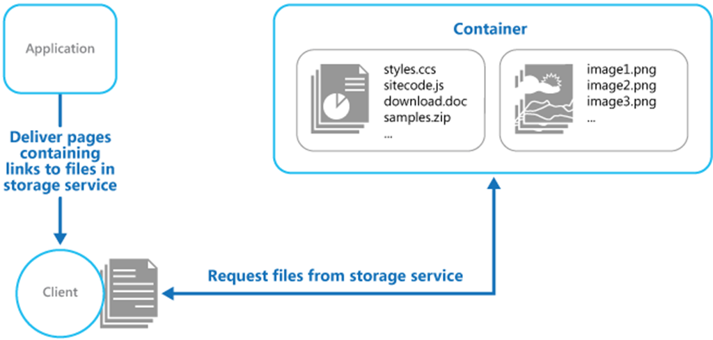
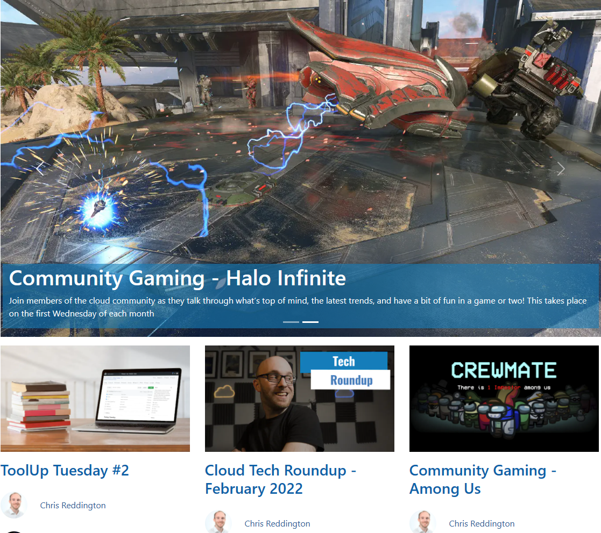

+++
title = "Deploying Static Websites to Azure the cheap and performant way"
outputs = ["Reveal"]
[logo]
src = "images/cwc-logo.png"
[reveal_hugo]
custom_theme = "custom-theme.scss"
custom_theme_compile = true
transition = "none"
+++



# Deploying Static sites to Azure the cheap and performant way

###### Chris Reddington | [@reddobowen](https://twitter.com/reddobowen)

---



# Chris Reddington

* Microsoft Cloud Solution Architect
* [Cloud With Chris](https://www.cloudwithchris.com) blogger, podcaster & producer
* [Azure Thames Valley](https://www.meetup.com/Azure-Thames-Valley/)

 
 

  

    <a href="https://www.meetup.com/Azure-Thames-Valley/" style="display: flex; align-items: center; justify-content: center">
      

        
      

      

        
Azure Thames Valley

      

    </a>
  

  

    <a href="https://github.com/CloudWithChris" style="display: flex; align-items: center; justify-content: center">
      

        
      

      

        
CloudWithChris

      

    </a>
  

  

    <a href="https://youtube.com/c/CloudWithChris" style="display: flex; align-items: center; justify-content: center">
      

        
      

      

        
CloudWithChris

      

    </a>
  

  

    <a href="https://twitter.com/reddobowen" style="display: flex; align-items: center; justify-content: center">
      

        
      

      

        
@reddobowen

      

    </a>
  

  

    <a href="https://github.com/chrisreddington" style="display: flex; align-items: center; justify-content: center">
      

        
      

      

        
ChrisReddington

      

    </a>
  

  

    <a href="https://linkedin.com/in/chrisreddington" style="display: flex; align-items: center; justify-content: center">
      

        
      

      

        
Chris Reddington

      

    </a>
  

---



# A quick poll. How is your experience with...

  

    <ul>
      <li>Hugo, or other Static Site generators?</li>
      <li>
        Azure
        <ul>
          <li>Azure Storage Accounts</li>
          <li>Azure Static Web Apps</li>
          <li>Content Delivery Networks (CDNs)</li>
        </ul>
      </li>
    </ul>
  

  

    <ul>
      <li>Beginner</li>
      <li>Intermediate</li>
      <li>Advanced</li>
    </ul>
  

---

# This talk will help you...

- Understand the Static Content Hosting Cloud Design Pattern
- Understand the concept of Jamstack and how Static Site Generators like Hugo relate to the above pattern
- Use the relevant Azure Services including Azure Storage or Azure Static Websites, Azure CDN and Azure DNS to implement the pattern

---

{}

{}
Deploy static content to a cloud-based storage service that can deliver them directly to the client. This can reduce the need for potentially expensive compute instances.
{}

# Static Content Hosting Pattern is useful when...

  

    
  

  

  <ul>
    <li>Wanting to minimise the cost of hosting static resources from expensive compute platforms (e.g. images for a dynamic website, or an entire website that is static in nature)</li>
    <li>Making content accessible across geographical regions by using Content Delivery Networks (CDNs).</li>
  </ul>
  

---

{}
Deploy static content to a cloud-based storage service that can deliver them directly to the client. This can reduce the need for potentially expensive compute instances.
{}

# Static Content Hosting Pattern may not be useful when...

  

    
  

  

  <ul>
    <li>The content is dynamic in nature (e.g. needs to add some additional information before serving the result to client)</li>
    <li>If using this alongside a compute platform and offloading a small amount of static content, is the work/re-architecture worth the reward?</li>
  </ul>
  

---

# Static Content Hosting Pattern Additional Considerations

  

  <ul>
    <li>The Static Content must be exposed over an HTTP/HTTPS endpoint so that it can be accessed</li>
    <li>If some content shouldn’t be available anonymously, consider leveraging the Valet Key pattern (e.g. Shared Access Signatures in Storage Accounts)</li>
  </ul>
  

  

    
  

---

# Static Content Hosting Pattern Additional Considerations

  

  <ul>
    <li>Adopt a CDN to protect the origin and minimise latency (improving performance) for end users</li>
    <li>Consider additional complexity & deployment lifecycle if using this pattern in combination with additional compute platforms</li>
  </ul>
  

  

    
  

{}

---


{}
**Pre-rendering**
With Jamstack, the entire front end is prebuilt into highly optimized static pages and assets during a build process. This process of pre-rendering results in sites which can be served directly from a CDN, reducing the cost, complexity and risk, of dynamic servers as critical infrastructure.
With so many popular tools for generating sites, like Gatsby, Hugo, Jekyll, Eleventy, NextJS, and very many more, many web developers are already familiar with the tools needed to become productive Jamstack developers.

**Enhancing with JavaScript**
With the markup and other user interface assets of Jamstack sites served directly from a CDN, they can be delivered very quickly and securely. On this foundation, Jamstack sites can use JavaScript and APIs to talk to backend services, allowing experiences to be enhanced and personalized.

**Supercharging with services**
The thriving API economy has become a significant enabler for Jamstack sites. The ability to leverage domain experts who offer their products and service via APIs has allowed teams to build far more complex applications than if they were to take on the risk and burden of such capabilities themselves. Now we can outsource things like authentication and identity, payments, content management, data services, search, and much more.
Jamstack sites might utilise such services at build time, and also at run time directly from the browser via JavaScript. And the clean decoupling of these services allows for greater portability and flexibility, as well as significantly reduced risk.
{}

# Jamstack

**J**avaScript, **A**PIs and **M**arkup

---



{}
**Entire Project on a CDN**
Because Jamstack projects don’t rely on server-side code, they can be distributed instead of living on a single server. Serving directly from a CDN unlocks speeds and performance that can’t be beat. The more of your app you can push to the edge, the better the user experience.

**Modern Build Tools**
Take advantage of the world of modern build tools. It can be a jungle to get oriented in and it’s a fast moving space, but you’ll want to be able to use tomorrow’s web standards today without waiting for tomorrow’s browsers. And that currently means Babel, PostCSS, Webpack, and friends.

**Automated Builds**
Because Jamstack markup is prebuilt, content changes won’t go live until you run another build. Automating this process will save you lots of frustration. You can do this yourself with webhooks, or use a publishing platform that includes the service automatically.

**Atomic Deploys**
As Jamstack projects grow really large, new changes might require re-deploying hundreds of files. Uploading these one at a time can cause inconsistent state while the process completes. You can avoid this with a system that lets you do “atomic deploys,” where no changes go live until all changed files have been uploaded.

**Instant Cache Invalidation**
When the build-to-deploy cycle becomes a regular occurrence, you need to know that when a deploy goes live, it really goes live. Eliminate any doubt by making sure your CDN can handle instant cache purges.

**Everything Lives in Git**
With a Jamstack project, anyone should be able to do a git clone, install any needed dependencies with a standard procedure (like npm install), and be ready to run the full project locally. No databases to clone, no complex installs. This reduces contributor friction, and also simplifies staging and testing workflows.
{}

# Jamstack Recommended Practices

* Entire Project on a CDN
* Modern Build Tools
* Automated Builds
* Atomic Deploys
* Instant Cache Invalidation
* Everything Lives in Git

---



{}
## Hugo

* Uses GoLang
* Plenty of themes out there for you to get going quickly
* Great documentation
* Very fast
* Brilliant community around it
* Lots of built-in templates to get going quickly

## Jekyll

* Built using Ruby
* Has been around for some time
* Great GitHub integration - GitHub pages are powered by Jekyll!
* Great Documentation
* Can be a challenge to setup

## Gatsby

* Optimised for speed
* Uses GraphQL
* Has lots of APIs
* Documentation (?)

## Vuepress

* VueJS
* PWA Features
* Google Analytics
* Markdown to HTML

## Nuxt.JS

* VueJS framework

## Pelican

* Uses Python
* Requires Python to be installed when adding/editing content

{}

# Static Site Generators you may recognise…

---

# Cloud With Chris Architecture

---

# Stop! Demo time.

---



# How to learn more...

  

    

    <ul>
      <li><a href="https://www.cloudwithchris.com">Cloud With Chris</a></li>
      <li><a href="https://lab.github.com">GitHub Learning Labs</a></li>
      <li><a href="https://docs.microsoft.com/en-us/learn/github">Microsoft Learn</a></li>
    </ul>    
    
  

  

    
  

 

---

# Questions?

