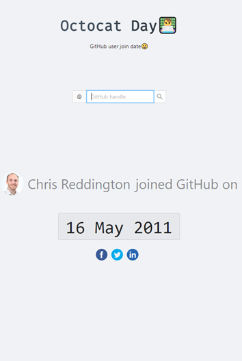
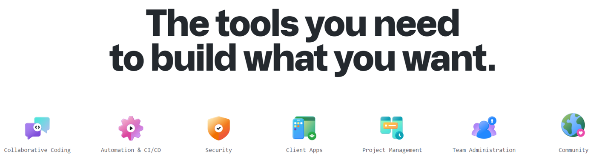
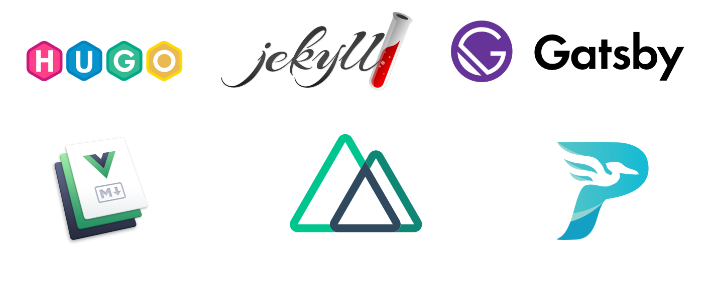
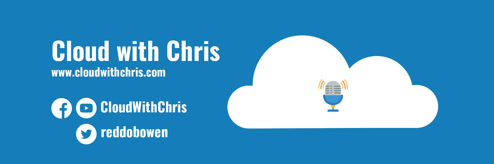

+++
title = "GitHub - Not just a Git repository"
outputs = ["Reveal"]
[logo]
src = "images/cwc-logo.png"
[reveal_hugo]
custom_theme = "custom-theme.scss"
custom_theme_compile = true
transition = "none"
+++




# GitHub - Not just a Git repository

###### Chris Reddington | [@reddobowen](https://twitter.com/reddobowen)

---



# Chris Reddington

* Microsoft Cloud Solution Architect
* [Cloud With Chris](https://www.cloudwithchris.com) blogger, podcaster & producer
* [Azure Thames Valley](https://www.meetup.com/Azure-Thames-Valley/)

<br />
 
<div class="container">
  <div class="col">
    <a href="https://www.meetup.com/Azure-Thames-Valley/" style="display: flex; align-items: center; justify-content: center">
      <div>
        
      </div>
      <div>
        <p>Azure Thames Valley</p>
      </div>
    </a>
  </div>
  <div class="col">
    <a href="https://github.com/CloudWithChris" style="display: flex; align-items: center; justify-content: center">
      <div>
        
      </div>
      <div>
        <p>CloudWithChris</p>
      </div>
    </a>
  </div>
  <div class="col">
    <a href="https://youtube.com/c/CloudWithChris" style="display: flex; align-items: center; justify-content: center">
      <div>
        
      </div>
      <div>
        <p>CloudWithChris</p>
      </div>
    </a>
  </div>
</div><div class="container">
  <div class="col">
    <a href="https://twitter.com/reddobowen" style="display: flex; align-items: center; justify-content: center">
      <div>
        
      </div>
      <div>
        <p>@reddobowen</p>
      </div>
    </a>
  </div>
  <div class="col">
    <a href="https://github.com/chrisreddington" style="display: flex; align-items: center; justify-content: center">
      <div>
        
      </div>
      <div>
        <p>ChrisReddington</p>
      </div>
    </a>
  </div>
  <div class="col">
    <a href="https://linkedin.com/in/chrisreddington" style="display: flex; align-items: center; justify-content: center">
      <div>
        
      </div>
      <div>
        <p>Chris Reddington</p>
      </div>
    </a>
  </div>
</div>

---



# A quick poll. How is your experience with...

<div class="container">
  <div class="col">
    <ul>
      <li>Azure</li>
      <li>GitHub</li>
      <li>GitHub Actions</li>
      <li>Hugo</li>
    </ul>
  </div>

  <div class="col">
    <ul>
      <li>Beginner</li>
      <li>Intermediate</li>
      <li>Advanced</li>
    </ul>
  </div>
</div>

---

# This talk will help you...

- Identify some of the core features of GitHub
- Understand the fundamental concepts of GitHub Actions
- Locate existing samples to help you deploy to Azure
- Understand how (and why) [cloudwithchris.com](https://www.cloudwithchris.com) is deployed using GitHub Actions

---

# A history...

<div class="container">
  <div class="col">
    
  </div>
  <div class="col">
    <ul>
      <li><strong>2008</strong> - GitHub was Founded</li>
      <li><strong>2012</strong> - Microsoft become a significant user of GitHub</li>
      <li><strong>2018</strong> - GitHub became a subsidiary of Microsoft for $7.5 billion!</li>
      <li><strong>2019, Jan</strong> - GitHub offers unlimited private repositories to all plans, including free accounts (but up to three collaborators per repository).</li>
    </ul>
  </div>
</div>

---

# A history...

<div class="container">
  <div class="col">
    <ul>
      <li><strong>2019, Sept</strong> - GitHub acquired Semmle, a code analysis tool.</li>
      <li><strong>2020, March</strong> - GitHub announced that they were acquiring npm</li>
      <li><strong>2020, April</strong> - The free plan allows unlimited collaborators, but limit private repos to 2000 minutes of GitHub Actions per month</li>
    </ul>
  </div>
  <div class="col">
    
  </div>
</div> 

---


{}
We will primarily focus on these three sections. However, there is so much value in some of the other areas – e.g.

## Security

* **Private Repos**  - Host code that you don't want to share with the world in private GitHub repos only accessible to you and people you share them with.
* **2FA** - Add an extra layer of security with two -actor authentication (2FA) when logging into GitHub. Require 2FA and choose from TOTP apps, security keys, and more.
* **Required Reviewers**  - Ensure that pull requests have a specific number of approving reviews before collaborators can make changes to a protected branch.
* **Required Status Checks** - Ensure that all required CI tests are passing before collaborators can make changes to a protected branch.
* **Code Scanning** - Find vulnerabilities in custom code using static analysis. Prevent new vulnerabilities from being introduced by scanning every pull request.
* **Secret Scanning** - Find secrets hard-coded in your public and private repositories. Revoke them to keep access to the services you use secure.
* **Dependency Graph** - See the packages your project depends on, the repositories that depend on them, and any vulnerabilities detected in their dependencies.
* **Dependabot Alerts** - Get notified when there are new vulnerabilities affecting your repositories. GitHub detects and alerts users to vulnerable dependencies in public and private repos.
* **Dependabot Security and Version Updates** - Keep your supply chain secure and up-to-date by automatically opening pull requests that update vulnerable or out-of-date dependencies.
* **Dependency Reviews** - Understand the security impact of newly introduced dependencies during pull requests, before they get merged.
* **GitHub Security Advisories** - Privately discuss, fix, and publish information about security vulnerabilities found in your repository.
* **GitHub Advisory Database** - Browse or search for the vulnerabilities that GitHub knows about. The database contains all curated CVEs and security advisories on the GitHub dependency graph.
* **GPG commit signing verification** - Use GPG or S/MIME to sign tags and commits locally. These are marked as verified on GitHub so other people know the changes come from a trusted source.
* **Security Audit Log** - Quickly review the actions performed by members of your organization. Your audit log includes details like who performed an action and when.

## Client Apps

* **GitHub for Mobile** - Take your GitHub projects, ideas, and code to go with a fully-native mobile and tablet experience. Triage, review, and merge from anywhere.
* **GitHub CLI**  - Bring GitHub to the command line. Manage issues and pull requests from the terminal, where you're already working with Git and your code.
* **GitHub Desktop** - Simplify your development workflow with a GUI. Visualize, commit, and push changes without ever touching the command line.

## Community

* **GitHub marketplace** - Install apps that integrate directly with GitHub's API to customize and optimize your workflows – build your own for private use or publication in the GitHub Marketplace.
* **GitHub Sponsors** -  Financially support the open source projects your code depends on. Sponsor a contributor, maintainer, or project with one time or recurring contributions
* **GitHub Learning Lab** - Learn new skills by completing tasks and projects directly within GitHub, guided by our friendly Learning Lab bot.
{}

# An extensive platform

GitHub is much more than just Git repositories.



---



{}
## Hugo

* Uses GoLang
* Plenty of themes out there for you to get going quickly
* Great documentation
* Very fast
* Brilliant community around it
* Lots of built-in templates to get going quickly

## Jekyll

* Built using Ruby
* Has been around for some time
* Great GitHub integration - GitHub pages are powered by Jekyll!
* Great Documentation
* Can be a challenge to setup

## Gatsby

* Optimised for speed
* Uses GraphQL
* Has lots of APIs
* Documentation (?)

## Vuepress

* VueJS
* PWA Features
* Google Analytics
* Markdown to HTML

## Nuxt.JS

* VueJS framework

## Pelican

* Uses Python
* Requires Python to be installed when adding/editing content

{}

# JAMStack (JavaScript, APIs & Markup)




---

# Cloud With Chris Architecture


---

# Stop! Demo time.


---

# GitHub Actions Workflow Schema

```yaml{2-5|9|12,14}
name:
  on:
    push:
      branches:
        - dev
jobs:
  linter:
    name: "Lint codebase"
    runs-on: ubuntu-latest
    steps:
      - name: "Checkout Code"
        uses: actions/checkout@v2
      - name: "Lint Codebase"
        uses: github/super-linter@v3
	 env:
	   ……
  build:
    needs: linter
  …… 
```

---

# GitHub Actions Workflow Schema

```yaml{3-4|9,13,17|15}
…
publish:  
  environment:
    name: preview.azure  
  runs-on: ubuntu-latest
  needs: build
  steps:    
  - name: Download website changes
    uses: actions/download-artifact@v1
    with:
      name: website
  - name: Azure Login
    uses: azure/login@v1
    with:
      creds: ${{ secrets.AZURE_CREDENTIALS }}     
  - name: Azure CLI script
    uses: azure/CLI@v1
    with:
      azcliversion: 2.0.72
      inlineScript: |
        az storage blob upload-batch --account-name cloudwithchrispreview -d '$web/${{ github.head_ref }}' -s 'website'
```

---



# How to learn more...

<div class="container">
  <div class="col">
    <p>
    <ul>
      <li><a href="https://www.cloudwithchris.com">Cloud With Chris</a></li>
      <li><a href="https://lab.github.com">GitHub Learning Labs</a></li>
      <li><a href="https://docs.microsoft.com/en-us/learn/github">Microsoft Learn</a></li>
    </ul>    
    
  </div>
  <div class="col">
    
  </div>
</div> 

---

# Questions?

[](https://www.cloudwithchris.com)