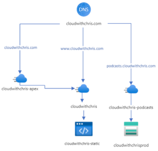

+++
title = "Logo presentation example"
outputs = ["Reveal"]
[logo]
src = "images/cwc-logo.png"
[reveal_hugo]
custom_theme = "custom-theme.scss"
custom_theme_compile = true
+++


# GitHub - More than just a Git repository

###### Chris Reddington | [@reddobowen](https://twitter.com/reddobowen)

{}
Don't forget to thank the audience.
{}

---

- @reddobowen
- ChrisReddington
- CloudWithChris

- Host and producer of Cloud With Chris
- Co-Organizer of Azure Thames Valley
- Cloud Solution Architect at Microsoft
- Musical Theatre Enthusiast & Improving Improviser

---

# A quick poll. How is your experience with...

* Azure?
* GitHub?
* GitHub Actions?
* Hugo?

Beginner / Intermediate / Advanced

---

# This talk will help you...

- Identify some of the core features of GitHub
- Understand the fundamental concepts of GitHub Actions
- Locate existing samples to help you tploy to Azure
- Understand how (and why) [cloudwithchris.com](https://www.cloudwithchris.com) is deployed using GitHub Actions

---

{}

# A history...


- 2008 - GitHub was Founded
- From 2012 - Microsoft become a significant user of GitHub
- 2018 - GitHub became a subsidiary of Microsoft for $7.5 billion!
- Jan 2019 - GitHub offers unlimited private repositories to all plans, including free accounts (but up to three collaborators per repository).

---

# A history...


- Sept 2019 - GitHub acquired Semmle, a code analysis tool.
- March 2020 - GitHub announced that they were acquiring npm
- April 2020 - The free plan allows unlimited collaborators, but limit private repos to 2000 minutes of GitHub Actions per month

{}

---

# An extensive platform

GitHub is much more than just Git repositories.


---


---

# Cloud With Chris Architecture




---
# Stop! Demo time.


---

{}

# GitHub Actions Workflow Schema

```yaml{2-5|11-14}
name:
  on:
    push:
      branches:
        - dev
jobs:
  linter:
    name: "Lint codebase"
    runs-on: ubuntu-latest
    steps:
      - name: "Checkout Code"
        uses: actions/checkout@v2
      - name: "Lint Codebase"
        uses: github/super-linter@v3
	 env:
	   ……
  build:
    needs: linter
  …… 
```

---

# GitHub Actions Workflow Schema

```yaml{2-4|7-18}
…
publish:  
  environment:
    name: preview.azure  
  runs-on: ubuntu-latest
  needs: build
  steps:    
  - name: Download website changes
    uses: actions/download-artifact@v1
    with:
      name: website
  - name: Azure Login
    uses: azure/login@v1
    with:
      creds: ${{ secrets.AZURE_CREDENTIALS }}     
  - name: Azure CLI script
    uses: azure/CLI@v1
    with:
      azcliversion: 2.0.72
      inlineScript: |
        az storage blob upload-batch --account-name cloudwithchrispreview -d '$web/${{ github.head_ref }}' -s 'website'
```

{}

---

# How to learn more...

- [GitHub Labs](https://lab.github.com)
- [Microsoft Learn](https://docs.microsoft.com/en-us/learn/github)

---
<!-- _header: "" -->
<!-- _footer: "" -->

# Questions?